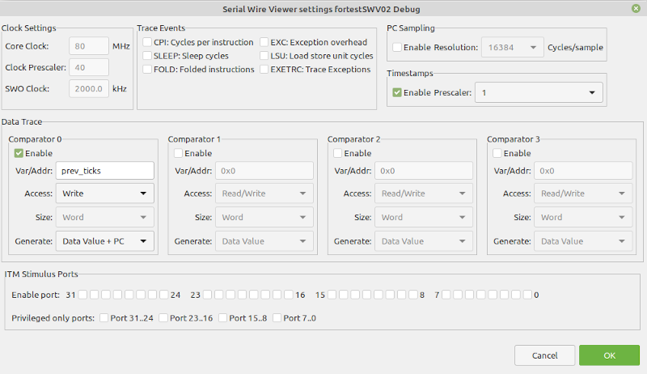

# Using SWV with an STM32 microcontroller

## Overview

SWV (Serial Wire Viewer) is a trace feature that can be used with many ARM Cortex-M3, M4 and higher processors (but not with Cortex-M0 and Cortex-M0+). SWV trace information can be sent out using a dedicated pin, SWO (Serial Wire
Output) pin, to the debugging host. The following features are provided:
* Program counter sampling
* Event counters that show CPU cycle statistics
* Exception and Interrupt execution with timing statistics
* Trace data - data reads and writes used for timing analysis
* Trace information used for simple printf-style debugging

SWV can be activated when debugging with SWD (Serial Wire Debug), the Arm's alternative to JTAG.

This article presents an overview of the configuration and use of SWV, for an STM32 Nucleo board, the [NUCLEO-L476RG](https://www.st.com/en/evaluation-tools/nucleo-l476rg.html). This board integrates an ST-LINK programmer/debugger, so there is no need for a separate JTAG/SWD probe. We use [STM32CubeIDE](https://www.st.com/en/development-tools/stm32cubeide.html) version 1.8.0 as development environment.

## Prerequisites

* A NUCLEO-L476RG board (see above)
* STM32CubeIDE version 1.8.0 (see above)
* some experience of STM32CubeIDE: creating a new project, building it, creating a debug configuration, debugging

## Creating an SWV-enabled application

### Hardware

For STM32 microcontrollers, SWD is mapped to PA13 (SWDIO), PA14 (SWCLK) and PB3 (SWO). 

When creating a new project, CubeMX sets PA13 and PA14 as active (green color in CubeMX view below), while PB3 is reserved but inactive (orange color). 

A good thing is to declare PB3 as active, in order to protect it from being selected for another use, so that we can use SWO.


This is done by selecting **Trace Asynchronous Sw** for **Debug** in **System Core > SYS**, in **Pinout & Configuration** tab, for `ioc` file generated by CubeMX. PB3 color switches to green.

While in CubeMX, check the value of HCLK, in the **Clock Configuration** tab:


This value will have to be used when configuring SWV.

Save the `ioc` file, generate code and build the project.

### Software

#### Displaying exceptions with SWV

Create an empty STM32 project, and configure it as presented in the above section.

Create a debug configuration for the project. In the **Debugger** tab, tick **Enable** in the **Serial Wire Viewer** pane. Then set **Core Clock** to the value of HCLK. For me, Core Clock was set to 16.0 by default. I set it to the value of HCLK: 80.


Start the debug session.

The execution stops at the first instruction after `main()`. Select **Window > Show View > SWV > SWV Exception Trace Log**. Click on the **SWV Exception Trace Log** tab that has been added to the window containing the **Console** tab.

Then click on the settings icon (wrench + screwdriver), on the right-hand side.


In the newly displayed window, tick **EXETRC: Trace Exceptions**. Click on the **OK** button.


Last step: click on the red button, at the right of the settings icon. This instructs SWV to start tracing as soon as the program execution is resumed.

Resume the execution.

The SWV Exception Trace Log tab displays the exceptions when they happen. In our example, the only active code is the SysTick handler, called every time the SysTick interruption is triggered. Consequently, the **Data** tab of the SWV Exception Trace Log tab only displays periodic calls to the SysTick handler:


The **Statistics** tab makes clear that SysTick handler is the only active code:


#### Displaying the value of a variable with SWV

SWV allows to display the value of a variable, almost in real time, without disturbing the execution conditions of the application.

To test this function, we declare a few variables at the main level of `main.c`:

```C
/* USER CODE BEGIN PV */
static const uint32_t PERIOD = 1000;
static uint32_t prev_ticks = 0;
static uint32_t new_ticks;
/* USER CODE END PV */
```

Then, we modify the infinite `while` loop of the `main()` function, in order to increment `prev_ticks` every second:

```C
  /* USER CODE BEGIN WHILE */
  while (1)
  {
    new_ticks = HAL_GetTick() / PERIOD;
    if (new_ticks > prev_ticks)
      {
	    prev_ticks = new_ticks;
      }
    /* USER CODE END WHILE */

    /* USER CODE BEGIN 3 */
  }
  /* USER CODE END 3 */
```

Start a debug session, and open the SWV settings window. In this window, tick **Enable** for the Comparator 0. Set **Var/Addr** to `prev_ticks`. Select **Write** for **Access** and **Data Value + PC** for **Generate**. Close the window.



Select **Window > Show View > SWV > SWV Trace Log**. This adds a new tab, **SWV Trace Log** to the console window.

Now click on the SWV red button, to start the SWV session, and resume execution. 

The SWV Trace Log tab displays every write operation to the variable, with the value of the PC for the instruction which performed the write operation:


*To be continued...*
